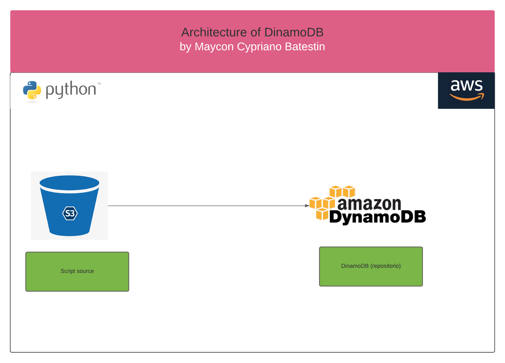

<h1 align="center">

<h3> 
 AMAZON DINAMODB  
 </h3>
<h3> 
 ================= 
 </h3>

>> Arquitetura da solução:

>> <h3> Description </h3>
-------------------------

 
Amazon DynamoDB is a fully managed NoSQL database service that provides fast, predictable performance with built-in scalability. DynamoDB lets you offload the administrative burden of operating and scaling a distributed database.
In this project we created a Harry Potter NoSQL database. They are fake data that can have 100 records. We created a Python script that transfers the files directly to the database, quickly and safely.

-------------------------

